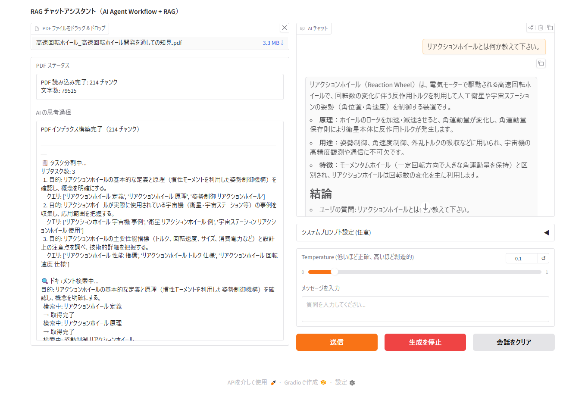

# GEN_AI_RAG
**Agentic RAG ： 生成AI＋RAG＋AIエージェントのテスト実装のリポジトリです。**

- [<u>**Agentic RAG でのマルチターンチャットの例**</u>](notebook/outputs/07_chat_log.md)
- [<u>**上のチャットでの AI の思考過程の例**</u>](notebook/outputs/07_reasoning_log.md)

#### 目標
- OSSのモデル ＋（インメモリ）ベクトルデータベース ＋ 自己修正機能（AIエージェント）＋ GradioのUIまでの構築。
- 上記の各要素を実装するためのノートブック作成
- Github / Google Colab のテスト使用

#### 進行状況
- notebook での実装確認が完了。今後、スクリプトへの移植を実施予定。（移植後、本リポジトリは完了）

#### 環境
- 開発環境：Windows / Python / VS Code / Claude Code
- 計算環境：Google Colab（VS Code 拡張機能経由で使用）
- AI開発フレームワーク：LangGraph / LangChain
- LLM モデル：gpt-oss:20b（OSSモデル, 商用利用可能）。Ollama ライブラリからダウンロードして構築
- Embedding モデル：cl-nagoya/ruri-v3-310m（OSSモデル, 商用利用可能）。Hugging Faceからダウンロードして構築
- Reranker モデル：cl-nagoya/ruri-v3-reranker-310m（OSSモデル, 商用利用可能）。Hugging Faceからダウンロードして構築
- フロントエンド：Gradio
- LLM バックエンド：Ollama（非同期処理、実装の容易さ、ツールコールのネイティブサポートから採用。初期の transformers ベースの実装は `notebook_transformers/` に保管）
- Embedding / Reranker バックエンド：Sentence Transformers（日本語性能を重視した OSS モデルを選定した結果、このバックエンドとなった）
- ベクトルデータベース：Chroma DB（インメモリ使用）

#### フォルダ・ファイル構成
|フォルダ・ファイル|説明|備考|
|:---|:---|:---|
|app/|Gradio UIのスクリプト|-|
|data/|RAGで読み込みするテストデータ（PDF）|githubには未アップロード|
|notebook/|各実装要素の確認用（Ollama ベース）|-|
|notebook_transformers/|初期の transformers ベース実装（アーカイブ）|[経緯](notebook_transformers/README.md)|
|outputs/|ファイル出力|-|
|src/|主要な実装コード|-|
|scripts/|前処理や読み込みモデルなどのチューニングが必要なコード|-|
|tests/|単体テストコード|-|
|.env|環境変数設定|githubには未アップロード。`notebook_transformers/` でのみ使用。|
|CLAUDE.md|Claude Code 向けの開発ルールとコマンド参照|-|
|README.md|本リポジトリの概要|この画面のdoc|

#### 動作確認に使用したテストデータ
> [井澤克彦, 市川信一郎, 高速回転ホイール: 高速回転ホイール開発を通しての知見, 宇宙航空研究開発機構研究開発報告, 2008](https://jaxa.repo.nii.ac.jp/records/2149)

#### LLM モデルに関するリンク
1. [Ollama のモデルライブラリ](https://ollama.com/library)
2. [Hugging Face](https://huggingface.co/)
3. [JMTEB Leaderboard（Embedding モデルの日本語性能のランキングリスト）](https://github.com/sbintuitions/JMTEB/blob/main/leaderboard.md)
4. [ruri-v3-reranker のモデルカード内に記載されるランキング（Reranker モデルの日本語性能のランキングリスト）](https://huggingface.co/cl-nagoya/ruri-v3-reranker-310m)
5. [Ollama での LLM の Thinking の仕様](https://docs.ollama.com/capabilities/thinking)

#### 参考文献
1. [浅野純季，木村真也，田中冬馬，武藤克大，栁泉穂, 先輩データサイエンティストからの指南書 -実務で生き抜くためのエンジニアリングスキル, 技術評論社, 2025](https://gihyo.jp/book/2025/978-4-297-15100-3)
   > 環境構築全般（Pythonのパッケージマネージャ～プロジェクトのフォルダ構成など）
2. [藤原惟, Markdownライティング入門　プレーンテキストで気楽に書こう！, インプレス NextPublishing, 2018](https://nextpublishing.jp/book/10278.html)
   > markdownの基本的な使い方
3. [山田育矢, 鈴木正敏，山田康輔，李凌寒, 大規模言語モデル入門, 技術評論社, 2023](https://gihyo.jp/book/2023/978-4-297-13633-8)
4. [山田育矢, 鈴木正敏，西川荘介，藤井一喜，山田康輔，李凌寒, 大規模言語モデル入門Ⅱ 〜生成型LLMの実装と評価, 技術評論社, 2024](https://gihyo.jp/book/2024/978-4-297-14393-0)
    > LLMの基礎原理やtransformersでの実装方法の解説（ただし、実装における計算条件の設定など、各ページに分散されている。）
5. [John Berryman, Albert Ziegler 著, 服部佑樹, 佐藤直生 訳, LLMのプロンプトエンジニアリング ―GitHub Copilotを生んだ開発者が教える生成AIアプリケーション開発, オライリー・ジャパン, 2025](https://www.oreilly.co.jp/books/9784814401130/)
    > LLMの基礎原理の解説（3, 4より難しいが、LLMの仕組みの本質的なイメージが説明されている。）
6. [Mayo Oshin, Nuno Campos 著, 新井翔太, 嶋田健志 訳, 初めてのLangChain ―LangChainとLangGraphによるAI/LLMアプリケーションの構築, オライリー・ジャパン, 2025](https://www.oreilly.co.jp/books/9784814401307/)
    > 2026/02時点で、LangGraphによるメモリ管理の記述がある和書
7. [西見公宏，吉田真吾，大嶋勇樹, LangChainとLangGraphによるRAG・AIエージェント［実践］入門, 技術評論社, 2024](https://gihyo.jp/book/2024/978-4-297-14530-9)
    > LangChain/LangGraphについて、2026/02時点で最も詳細な解説。ただし出版日が古く、メモリ管理の記述が古い。
8. [李碩根, からあげ, 渡邊拓夢, PythonではじめるMCP開発入門, 講談社サイエンティフィク, 2025](https://www.kspub.co.jp/book/detail/5412381.html)
    > MCPサーバの仕組みから実装方法までの解説
9. [御田稔, 大坪悠, 塚田真規, AIエージェント開発 / 運用入門 [生成AI深掘りガイド], SBクリエイティブ, 2025](https://www.sbcr.jp/product/4815636609/)
    > LangGraphと、LangGraph/MCPサーバの連携の実装方法などの解説
10. [太田真人, 宮脇峻平, 西見公宏, 後藤勇輝, 阿田木勇八, 現場で活用するためのAIエージェント実践入門, 講談社サイエンティフィク, 2025](https://www.kspub.co.jp/book/detail/5401408.html)
    > **AIエージェントの設計について、2026/02時点で最も実践的な解説**

    > AIエージェントワークフローで参考にした設計(https://github.com/masamasa59/genai-agent-advanced-book/tree/main/chapter4)
11. [榊剛史, 石野亜耶, 小早川健, 坂地泰紀, 嶋田和孝, 吉田光男, Pythonではじめるテキストアナリティクス入門, 講談社サイエンティフィク, 2022](https://www.kspub.co.jp/book/detail/5274101.html)
    > Python の scaPy を使ったテキストアナリティクスの入門書
12. [菅由紀子, Pythonではじめる　データ分析のための前処理入門, 講談社サイエンティフィク, 2025](https://www.kspub.co.jp/book/detail/5395868.html)
    > データ分析の前処理全般（テキストデータ含まれる）の入門書。なお、テキストデータの前処理コードは、scaPy ではないので、具体的な実装方法は AI に聞くなどする必要がある。
13. [掌田津耶乃, GeminiとはじめるPythonプログラミング, ラトルズ, 2025](https://shop.rutles.net/?pid=189405310)
    > Gradio に関する解説がある。
14. [蒲生弘郷, LLMの原理、RAG・エージェント開発から読み解く コンテキストエンジニアリング, 技術評論社, 2026](https://gihyo.jp/book/2026/978-4-297-15419-6)
    > （ノートブック作成後に参照したが）**Agentic RAG（生成AI＋RAG＋AIエージェント）の構築において、特に参照するべき資料。**