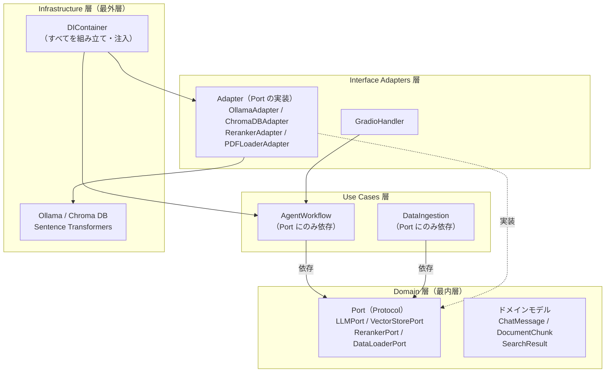

# 技術仕様書（Architecture）

## 1. テクノロジースタック

本プロジェクトは、製造業の機密技術資料を対象とした完全オフライン動作の Agentic RAG システムである。すべての AI 処理をローカル環境で完結させるため、商用利用可能な OSS モデルとオープンソースフレームワークで構成する。

### 1.1 フロントエンド / UI：Gradio

| 項目 | 内容 |
|---|---|
| ライブラリ | Gradio |
| 役割 | ブラウザベースの Web UI（チャット画面・ファイルアップロード・思考過程表示） |
| 採用理由 | Python のみで Web UI を構築でき、Google Colab 上でもそのまま動作する。チャットボット・ファイルアップロード・ストリーミング出力などの RAG に必要な UI コンポーネントが標準提供されている |

### 1.2 バックエンド / ワークフロー：Python, LangChain, LangGraph

| 項目 | 内容 |
|---|---|
| 言語 | Python |
| フレームワーク | LangChain / LangGraph |
| 役割 | Agentic RAG ワークフロー（タスク分割→検索→要約→判定→回答生成）のグラフ構築・実行、LLM 呼び出し、構造化出力（`with_structured_output`）、メモリ管理（マルチターンチャット） |
| 採用理由 | LangGraph は状態遷移グラフとしてエージェントワークフローを定義でき、自己修正ループ（judge → doc_search の条件分岐）を宣言的に記述できる。LangChain は LLM・ベクトル DB・Embedding の統一的なインターフェースを提供し、Pydantic モデルによる構造化出力との親和性が高い |

### 1.3 LLM / 推論エンジン：Ollama（モデル: gpt-oss:20b）

| 項目 | 内容 |
|---|---|
| 推論エンジン | Ollama |
| LLM モデル | gpt-oss:20b（OSS、商用利用可能） |
| 役割 | タスク分割・要約・十分性判定・回答生成の各ノードにおける推論処理、構造化出力（JSON スキーマ準拠）、Thinking 機能による推論過程の可視化 |
| 採用理由 | 非同期処理のネイティブサポート、ツールコール（関数呼び出し）のネイティブサポート、`reasoning` パラメータによる推論強度の段階制御（`low` / `medium` / `high`）が可能。ローカル環境で完結し、外部 API を使用しない |

### 1.4 ベクトルデータベース：Chroma DB（インメモリ使用）

| 項目 | 内容 |
|---|---|
| ライブラリ | Chroma DB |
| 使用形態 | インメモリ |
| 役割 | Embedding ベクトルの格納、コサイン類似度によるベクトル検索、BM25 によるキーワード検索（ハイブリッド検索の構成要素） |
| 採用理由 | Python ネイティブでインメモリ動作可能なため、外部サーバの構築が不要。プロトタイプ段階の Google Colab 環境で追加設定なしに動作する。永続化が不要なプロトタイプ用途に適合する |

### 1.5 Embedding / Reranker：Sentence Transformers

| 項目 | 内容 |
|---|---|
| ライブラリ | Sentence Transformers |
| Embedding モデル | cl-nagoya/ruri-v3-310m（OSS、商用利用可能） |
| Reranker モデル | cl-nagoya/ruri-v3-reranker-310m（OSS、商用利用可能） |
| 役割 | Embedding：テキストチャンクを数値ベクトルに変換し、ベクトル DB への格納および類似度検索に使用。Reranker：ハイブリッド検索の第1段階で広く収集した結果を、クロスエンコーダで精査し再ランキングする（2段階検索戦略の第2段階） |
| 採用理由 | 日本語の技術文書に対して高い性能を持つモデルを選定（JMTEB Leaderboard および ruri-v3-reranker のモデルカード内ランキングを参照）。Hugging Face からダウンロードしてローカルで動作するため、オフライン環境の要件を満たす |

### 1.6 データ前処理 / 解析

| ライブラリ | 役割 | 採用理由 |
|---|---|---|
| markitdown | PDF 等の技術資料を Markdown 形式に変換・構造化して抽出 | LLM と相性の良い Markdown 形式で文書構造（見出し・箇条書き・表）を保持したまま抽出でき、チャンク分割時に構造境界を活用して検索精度を向上させる |
| spaCy + GiNZA（`ja_ginza`） | 日本語テキストの形態素解析（BM25 用トークナイズ）、spaCy のバイト制限対策のためのブロック分割 | BM25 キーワード検索において日本語の適切なトークン化（名詞・動詞・形容詞の抽出、助詞・記号の除外）が必要。GiNZA は Universal Dependencies 準拠の高精度な日本語解析を提供する |
| rank_bm25 | BM25 キーワード検索（ハイブリッド検索の構成要素） | Chroma DB はベクトル検索に特化しておりネイティブの BM25 検索を提供しないため、BM25Okapi アルゴリズムを実装する軽量な Python ライブラリで補完する。spaCy の形態素解析でトークナイズしたチャンクリストに対して BM25 スコアリングを実行する |

---

## 2. 開発ツールと手法

### 2.1 開発環境と実行環境の分離（ハイブリッド構成）

本プロジェクトは、開発と実行を異なる環境で行うハイブリッド構成を採用している。

```
┌──────────────────────────────────┐     ┌──────────────────────────────────┐
│        開発環境（ローカル）         │     │      実行環境（クラウド GPU）       │
│                                  │     │                                  │
│  OS:     Windows 11              │     │  環境:  Google Colab              │
│  IDE:    VS Code                 │     │  形式:  Jupyter Notebook          │
│  AI:     Claude Code             │     │  GPU:   Colab 提供の GPU          │
│                                  │     │                                  │
│  ・src/ 配下のモジュール開発       │     │  ・notebook/ の .ipynb を実行      │
│  ・docs/ の設計ドキュメント管理     │────→│  ・src/ のモジュールを import      │
│  ・tests/ のテストコード作成       │     │  ・Gradio UI の起動・操作          │
│  ・Git によるバージョン管理        │     │  ・LLM / Embedding の GPU 推論     │
│                                  │     │                                  │
└──────────────────────────────────┘     └──────────────────────────────────┘
```

| 環境 | 役割 | 構成 |
|---|---|---|
| **開発環境** | コード開発・設計・テスト作成 | Windows / VS Code / Claude Code。仕様駆動開発により CLAUDE.md を起点としてドキュメントとコードを管理する |
| **実行環境** | テスト実行・動作確認・デモ | Google Colab（Jupyter Notebook 経由）。GPU を利用した LLM 推論・Embedding 計算を実行。Main ルーチンは `.ipynb` 形式で実装する（NFR-04） |

### 2.2 アーキテクチャ手法：Clean Architecture と DI

FD（機能設計書）で定義された Clean Architecture（依存性のルール）と DI（依存性の注入）を、以下の技術的手段で実現している。

#### 依存性のルール（The Dependency Rule）の実現

上位層（Domain / Use Cases）が下位層（Infrastructure / Frameworks）に直接依存しないことを、**`typing.Protocol`** によるインターフェース定義で技術的に担保する。



- **Port（`typing.Protocol`）**: Domain 層に `LLMPort`、`VectorStorePort`、`RerankerPort`、`DataLoaderPort` の4つのインターフェースを定義。Use Cases 層はこれらの Protocol にのみ依存する
- **Adapter**: Interface Adapters 層に各 Port の具体実装（`OllamaAdapter`、`ChromaDBAdapter` 等）を配置。外部ライブラリの呼び出しをカプセル化する
- **DI コンテナ**: Infrastructure 層の `DIContainer`（`src/infrastructure/di_container.py`）がすべての依存を組み立て、コンストラクタインジェクションで注入する

#### Pydantic による設定管理

ハイパーパラメータの一元管理に **Pydantic `BaseSettings`** を使用する（FD セクション 4.2 の `WorkflowConfig`）。

- 全パラメータ（LLM 設定・検索パラメータ・チャンク分割設定・システムプロンプト）を1ファイルに集約
- `Field(description=...)` による自己文書化
- DI コンテナ経由で各コンポーネントに注入し、ハードコードを排除
- 環境変数（`RAG_` プレフィックス）や `.env` ファイルからの上書きが可能

#### テスト容易性の実現

Port を実装するモック／スタブを DI コンテナから注入することで、LLM・DB・外部 API 等の外部依存を完全に切り離したユニットテストが可能となる（NFR-03）。テスト用の `WorkflowConfig` を渡すことで、ハイパーパラメータもテスト向けに調整できる。

---

## 3. 技術的制約と要件

### 3.1 インフラ制約：完全オフライン動作

| 制約 | 詳細 |
|---|---|
| **完全オフライン（オンプレミス想定）** | 製造業の機密情報保護のため、すべてのデータ処理（LLM 推論・Embedding・Reranking）がローカル環境内で完結する。外部ネットワークへのデータ送信は一切行わない |
| **外部 API 不使用** | OpenAI API・Google API 等のクラウド LLM サービスを一切使用しない。LLM（gpt-oss:20b）・Embedding（ruri-v3-310m）・Reranker（ruri-v3-reranker-310m）はすべてローカルにダウンロード済みの OSS モデルを使用する |
| **OSS モデル限定** | すべての AI モデルは商用利用可能な OSS ライセンスであること。将来的なオンプレミス GPU サーバへの展開を想定し、ライセンス上の制約がないモデルを選定する |

### 3.2 実行環境の制約：Google Colab（プロトタイプ段階）

| 制約 | 詳細 | 対応方針 |
|---|---|---|
| **GPU メモリ制限** | Google Colab の GPU メモリ（無料枠: 約15GB）に制約がある | 20B パラメータ規模の LLM（gpt-oss:20b）と 310M パラメータの Embedding / Reranker モデルが共存可能なメモリ範囲で運用。ベクトル DB はインメモリ（Chroma DB）で省メモリ化 |
| **Jupyter Notebook が Main ルーチン** | Google Colab は `.py` スクリプトの直接実行ではなく Jupyter Notebook（`.ipynb`）を実行環境とする（NFR-04） | Main ルーチンは Notebook 形式で実装し、`src/` 配下のモジュールを `import` して使用する設計。DIContainer による初期化と Gradio UI の起動を Notebook セル内で行う |
| **ファイルアクセスの制約** | Google Colab 環境ではローカルディスクへの直接アクセスが制限される | PDF ファイルの取り込みは Gradio UI のファイルアップロード機能経由で行う方式とする（PRD US-06） |
| **セッション揮発性** | Colab のランタイムが切断されるとインメモリデータが消失する | プロトタイプ段階ではインメモリ運用を許容。将来の本番環境ではベクトル DB の永続化を検討する |

### 3.3 データ制約：未加工の技術資料への対応

| 制約 | 詳細 | 対応アプローチ |
|---|---|---|
| **未加工データ** | 対象データは OCR 誤変換・改行混在・フォーマット不統一を含む未加工の技術資料（PDF）である | **markitdown** を用いて PDF を Markdown 形式に変換する。Markdown 化により、文書構造（見出し・箇条書き・表）を保持したまま構造化テキストとして抽出できる |
| **構造保持チャンク分割** | チャンク分割時に文書構造・文境界を無視すると検索精度が低下する | `SpacyTextSplitter`（`pipeline="ja_ginza"`）により文境界を考慮したチャンク分割を行う。短い粒度（デフォルト 500 文字）で分割し、2段階検索戦略（広域収集 + Reranker 精査）と組み合わせる |
| **テキストクリーニング** | OCR 由来のノイズ（1文字行の連続・過剰な空行等）が検索精度を低下させる | 前処理パイプラインで NFKC 正規化（全角・半角の統一）とクリーニング（1文字行ブロックの除去、連続空行の圧縮等）を実施してから Embedding・格納を行う |
| **日本語トークナイズ** | BM25 キーワード検索では日本語の適切な分かち書きが必要 | spaCy + GiNZA（`ja_ginza`）による形態素解析を用い、名詞・動詞・形容詞・固有名詞・数詞の見出し語（lemma）を抽出。ストップワードと単文字ノイズは除外する。モデルは初回ロード時にキャッシュされる |
| **Embedding プレフィックス** | ruri-v3 モデルはドキュメントとクエリで異なるプレフィックスを要求する | ドキュメント登録時に `"検索文書: "` プレフィックス、クエリ検索時に `"検索クエリ: "` プレフィックスを付与して Embedding 品質を最大化する |

---

## 4. パフォーマンス要件

### 4.1 レイテンシと UX

Agentic RAG は自律的に複数回の推論（Thinking）を繰り返すため、従来の単純検索と比較して回答までの所要時間が長くなることが前提となる。ユーザー体験を損なわないために、以下の UX 設計で体感待ち時間を軽減する。

| 要件 | 実現方法 |
|---|---|
| **ストリーミング出力** | 最終回答生成ノード（`generate_answer`）では Ollama の非同期ストリーミング API（`astream`）を使用し、トークン単位で逐次的に Gradio UI に表示する。ユーザーは回答全体の生成完了を待たずに、生成途中の回答を読み始められる |
| **思考過程のリアルタイム表示** | ワークフローの各フェーズ（タスク分割中・検索中・要約中・判定中・回答生成中）の進行状況を、Gradio UI の「AI の思考過程」エリアにリアルタイムで表示する。サブタスクの内容・検索結果件数・判定結果等をログとして出力し、システムが処理中であることをユーザーに伝える |
| **Thinking ログの可視化** | Ollama の Thinking 機能（`reasoning` パラメータ）で LLM が内部的に行う推論過程をログとして出力する。システム管理者が回答の信頼性を検証し、ハルシネーションのリスクを管理するための材料となる（PRD US-05） |

### 4.2 トークンとメモリ管理

ローカル LLM の限られたコンテキストウィンドウとインメモリベクトル DB の制約下で安定動作するために、以下のトークン・メモリ管理を行う。

#### インメモリベクトル DB（Chroma DB）の容量管理

| 項目 | 内容 |
|---|---|
| **容量制限** | インメモリ運用のため、格納可能なチャンク数は利用可能なメモリ量に依存する。Google Colab 環境では RAM の一部を消費する |
| **対応方針** | プロトタイプ段階では対象データ量が限定的であるため、インメモリ運用で十分な容量を確保できる。本番環境への移行時にはベクトル DB の永続化・スケーリングを検討する |

#### LLM コンテキストウィンドウの管理

| 項目 | 内容 |
|---|---|
| **コンテキストウィンドウサイズ** | デフォルト 16,384 トークン（`WorkflowConfig.llm_num_ctx`）。ノードごとの推論トークン＋出力トークンの合計をこの範囲内に収める必要がある |
| **「推論疲れ」の防止** | マルチターンチャットの継続や自己修正ループの反復により、LLM への入力コンテキストが増大すると、推論品質の低下（推論疲れ）が発生する。notebook 07 での検証で、判定ノードが応答不能になる事象が確認された |
| **要約ノード（summarize）の役割** | 検索結果をそのまま判定ノードに渡すとコンテキスト長が爆発するため、要約ノードを検索ノードと判定ノードの間に挿入し、検索結果を 800 文字以内に圧縮する。これにより判定ノードの入力コンテキストを削減し、安定動作を実現する |
| **ノードごとのトークン制限** | `num_predict` パラメータでノードごとの最大出力トークン数を制限する（構造化出力ノード: 4,096、要約ノード: 4,096）。LLM の長考による無駄なトークン消費を防止する |

#### 自己修正ループの制御

| 項目 | 内容 |
|---|---|
| **最大反復回数** | `WorkflowConfig.max_loop_count`（デフォルト: 2）で judge → doc_search の再調査ループに上限を設定。無限ループを防止する |
| **上限到達時の動作** | ループ上限に達した場合、その時点で得られた最善の回答を生成して返却する。エラー終了ではなく、グレースフルデグラデーションとして動作する |

#### 推論強度によるトークン消費の最適化

gpt-oss の `reasoning` パラメータにより、ノードの役割に応じて推論（Thinking）の強度を使い分け、トークン消費と精度のバランスを取る。

| ノード | reasoning | 理由 |
|---|---|---|
| `task_planning` | `low` | 構造化 JSON 出力タスク。軽い推論で十分 |
| `summarize` | `low` | テキスト圧縮タスク。最低限の推論で高速化 |
| `judge` | `low` | 十分性判断。軽い推論で十分 |
| `generate_answer` | `medium` | ユーザー向け最終回答。バランスの取れた推論力を活用 |
