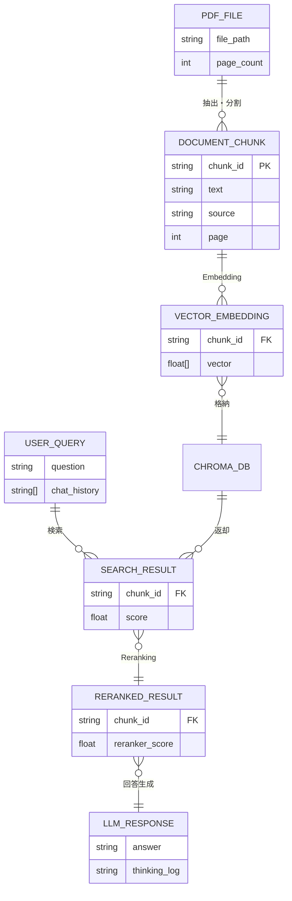
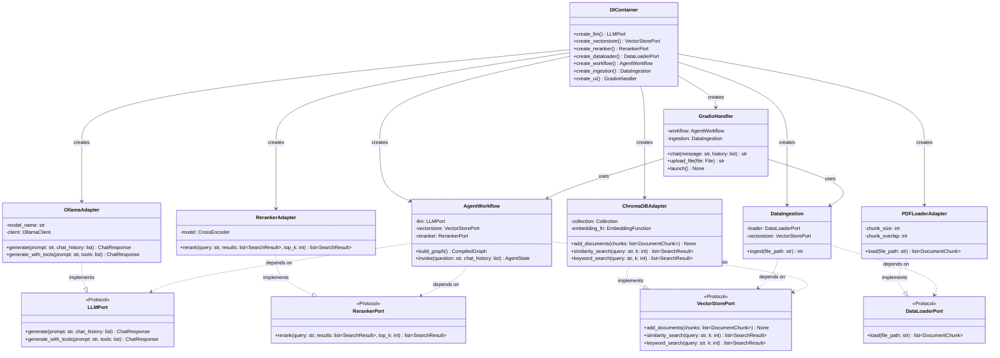
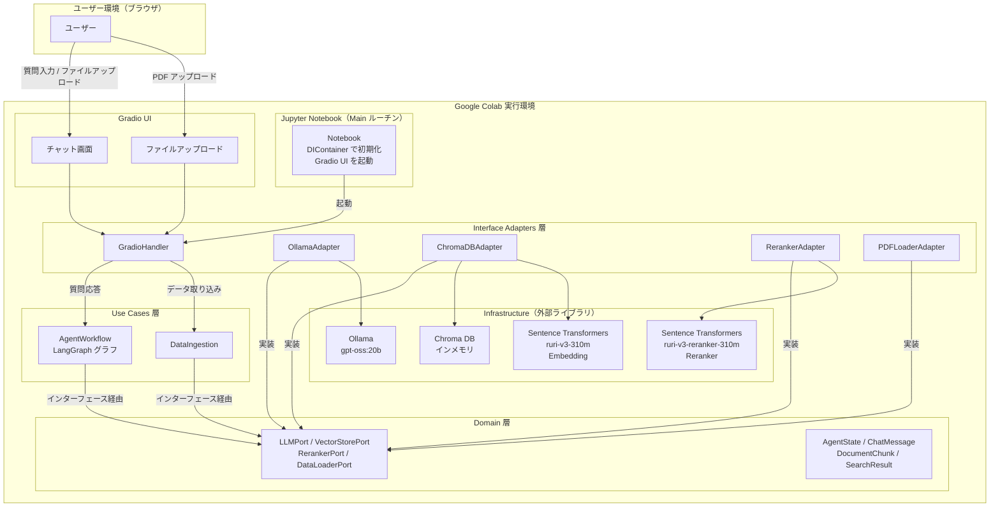
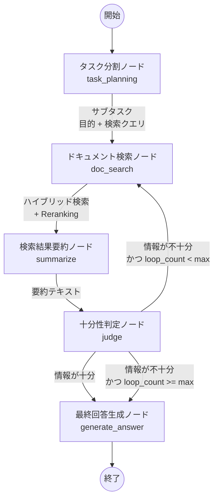
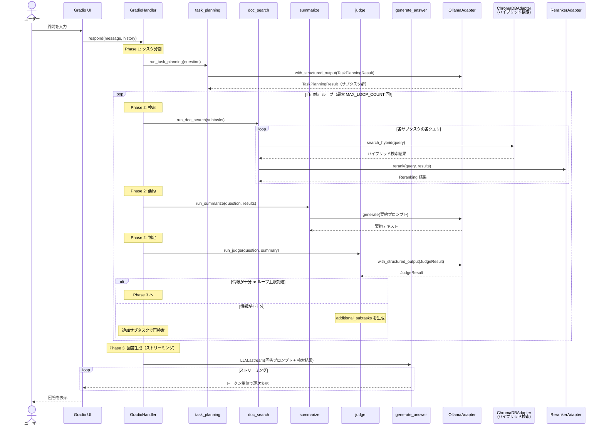
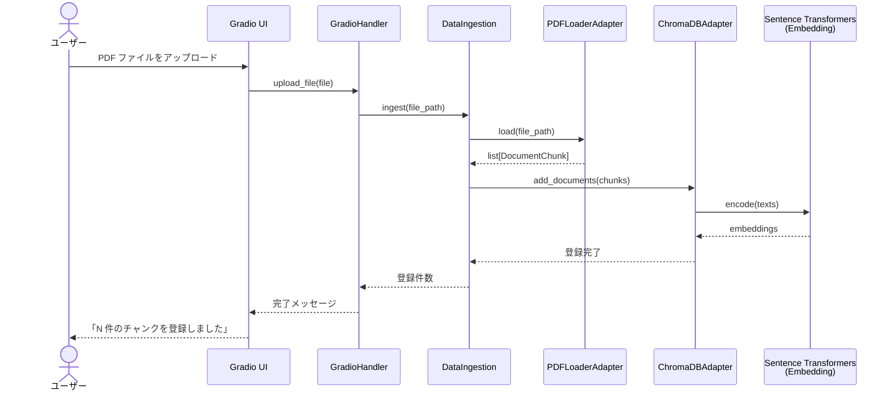
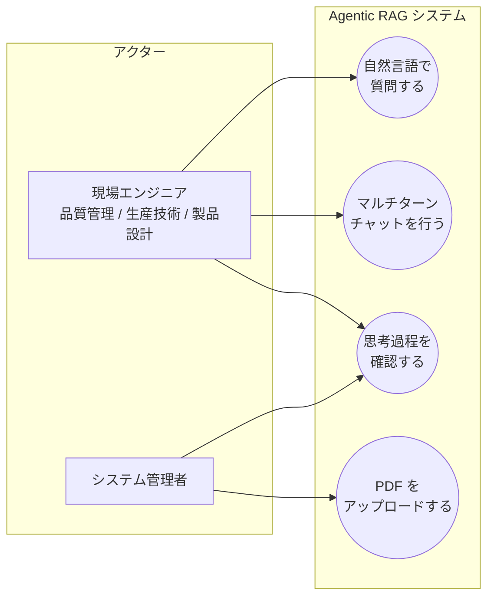

# 機能設計書（Functional Design）

## 1. 概要

本ドキュメントは、Agentic RAG システムの機能設計を定義する。PRD（`docs/product-requirements.md`）で定義された機能要件・非機能要件を、Clean Architecture に基づく具体的なモジュール構成・クラス設計・システムフローに落とし込む。

---

## 2. アーキテクチャ概要

### 2.1 設計方針

PRD の NFR-02 に基づき、Robert C. Martin の Clean Architecture における **The Dependency Rule（依存性のルール）** を適用する。上位層（Domain / Use Cases）は下位層（Infrastructure / Frameworks）に直接依存せず、インターフェース（抽象）を介して依存性を逆転させる。

### 2.2 層構成

| 層 | ディレクトリ | 役割 |
|---|---|---|
| **Domain（Entities）** | `src/domain/` | ドメインモデル、インターフェース定義（抽象クラス / Protocol） |
| **Use Cases** | `src/usecases/` | Agentic RAG ワークフロー、エージェントノードのビジネスロジック |
| **Interface Adapters** | `src/interfaces/` | 外部インフラの具体実装アダプタ、UI ハンドラ |
| **Infrastructure** | `src/infrastructure/` | 外部ライブラリ・フレームワークの直接利用コード |

---

## 3. ディレクトリ構成

```
src/
├── domain/                     # Domain 層（最内層）
│   ├── __init__.py
│   ├── config.py               # ハイパーパラメータ設定（WorkflowConfig）
│   ├── models.py               # ドメインモデル（ChatMessage, SearchResult 等）
│   └── ports/                  # インターフェース定義（Port）
│       ├── __init__.py
│       ├── llm_port.py         # LLM クライアントのインターフェース
│       ├── vectorstore_port.py # ベクトルストアのインターフェース
│       ├── reranker_port.py    # Reranker のインターフェース
│       └── dataloader_port.py  # データローダーのインターフェース
│
├── usecases/                   # Use Cases 層
│   ├── __init__.py
│   ├── agent_workflow.py       # LangGraph ワークフローグラフ定義
│   ├── nodes/                  # エージェントノード群
│   │   ├── __init__.py
│   │   ├── task_planning_node.py  # タスク分割ノード（サブタスク・検索クエリ生成）
│   │   ├── doc_search_node.py     # ドキュメント検索ノード（ハイブリッド検索 + Reranking）
│   │   ├── summarize_node.py      # 検索結果要約ノード
│   │   ├── judge_node.py          # 十分性判定ノード（自己修正判定）
│   │   └── generate_answer_node.py  # 最終回答生成ノード
│   └── data_ingestion.py      # データ取り込みユースケース
│
├── interfaces/                 # Interface Adapters 層
│   ├── __init__.py
│   ├── adapters/               # インフラアダプタ（Port の実装）
│   │   ├── __init__.py
│   │   ├── ollama_adapter.py   # Ollama LLM アダプタ
│   │   ├── chromadb_adapter.py # Chroma DB アダプタ
│   │   ├── reranker_adapter.py # Sentence Transformers Reranker アダプタ
│   │   └── pdf_loader_adapter.py  # PDF データローダーアダプタ
│   └── ui/                     # UI ハンドラ
│       ├── __init__.py
│       └── gradio_handler.py   # Gradio UI ハンドラ
│
└── infrastructure/             # Infrastructure 層（最外層）
    ├── __init__.py
    └── di_container.py         # DI コンテナ（依存性の組み立て）

app/                            # Gradio UI のエントリーポイント用スクリプト
scripts/                        # 前処理・チューニング用スクリプト
tests/                          # テストコード
notebook/                       # Jupyter Notebook（Main ルーチン）
data/                           # テストデータ（PDF）
```

### 3.1 データ取り込み前処理モジュールの差し替え設計

PRD の FR-02 および NFR-02 で要求される「データソースの種類に応じた前処理モジュールの差し替え」は、以下の構成で実現する。

- `src/domain/ports/dataloader_port.py` に **`DataLoaderPort`**（抽象インターフェース）を定義する。
- PDF 用の具体実装は `src/interfaces/adapters/pdf_loader_adapter.py` に配置する。
- 将来、CSV・Excel・Word 等の新しいデータソースに対応する場合は、`DataLoaderPort` を実装する新しいアダプタ（例: `csv_loader_adapter.py`）を `src/interfaces/adapters/` に追加するだけでよい。
- ドメインロジック（`src/usecases/data_ingestion.py`）は `DataLoaderPort` にのみ依存するため、前処理実装の変更はドメインロジックに影響を与えない。

---

## 4. ハイパーパラメータの一元管理

### 4.1 設計方針

notebook 07 ではハイパーパラメータがモジュールレベル定数として各所に散在している。本設計ではこれらを **Pydantic `BaseSettings`** で一元管理し、以下を実現する。

- ハイパーパラメータの定義箇所を1ファイルに集約し、チューニング時の見通しを確保する
- DI コンテナ経由で各コンポーネントに注入し、ハードコードを排除する
- 環境変数や `.env` ファイルからの上書きを可能にする（`BaseSettings` の標準機能）

### 4.2 設定クラス定義

```python
# src/domain/config.py

from pydantic_settings import BaseSettings
from pydantic import Field


class WorkflowConfig(BaseSettings):
    """Agentic RAG ワークフローのハイパーパラメータ"""

    # --- ループ制御 ---
    max_loop_count: int = Field(default=2, description="judge → doc_search 再調査ループの上限回数")

    # --- LLM 基本パラメータ ---
    llm_model_name: str = Field(default="gpt-oss:20b", description="Ollama LLM モデル名")
    llm_num_ctx: int = Field(default=16384, description="コンテキストウィンドウサイズ")
    llm_temperature: float = Field(default=0.8, description="デフォルト Temperature")
    llm_top_k: int = Field(default=40, description="Top-K サンプリング")
    llm_top_p: float = Field(default=0.9, description="Top-P サンプリング")
    llm_repeat_penalty: float = Field(default=1.1, description="繰り返しペナルティ")

    # --- ノードごとの推論パラメータ ---
    reasoning_task_planning: str = Field(default="low", description="task_planning の推論強度")
    reasoning_summarize: str = Field(default="low", description="summarize の推論強度")
    reasoning_judge: str = Field(default="low", description="judge の推論強度")
    reasoning_generate_answer: str = Field(default="medium", description="generate_answer の推論強度")

    # --- 構造化出力制御 ---
    structured_output_timeout: float = Field(default=120.0, description="構造化出力のタイムアウト（秒）")
    structured_output_num_predict: int = Field(default=4096, description="構造化出力の最大トークン数")
    summarize_timeout: float = Field(default=180.0, description="要約のタイムアウト（秒）")
    summarize_num_predict: int = Field(default=4096, description="要約の最大トークン数")

    # --- 検索パラメータ ---
    retrieval_top_k: int = Field(default=20, description="ハイブリッド検索の取得件数")
    rerank_top_k: int = Field(default=5, description="Reranking 後の上位件数")
    bm25_weight: float = Field(default=0.3, description="RRF ハイブリッド検索における BM25 の重み")
    max_return_chars: int = Field(default=8000, description="検索結果の最大文字数")

    # --- チャンク分割パラメータ ---
    chunk_size: int = Field(default=500, description="チャンクサイズ（文字数）")
    chunk_overlap: int = Field(default=100, description="チャンクオーバーラップ（文字数）")
    block_max_bytes: int = Field(default=40000, description="spaCy 分割前のブロック最大バイト数")

    # --- Embedding / Reranker モデル ---
    embedding_model_name: str = Field(default="cl-nagoya/ruri-v3-310m", description="Embedding モデル名")
    reranker_model_name: str = Field(default="cl-nagoya/ruri-v3-reranker-310m", description="Reranker モデル名")

    # --- システムプロンプト ---
    # 各ノードの振る舞いを制御するプロンプト。LLM モデルやドメインに応じてチューニングする。
    # デフォルト値はセクション 4.3 に記載。
    system_prompt_task_planning: str = Field(default=..., description="タスク分割ノードのシステムプロンプト")
    system_prompt_summarize: str = Field(default=..., description="要約ノードのシステムプロンプト")
    system_prompt_judge: str = Field(default=..., description="十分性判定ノードのシステムプロンプト")
    system_prompt_generate_answer: str = Field(default=..., description="回答生成ノードのシステムプロンプト")
    system_prompt_user_default: str = Field(default="日本語で回答してください。", description="Gradio UI のデフォルトシステムプロンプト（ユーザーが編集可能）")

    model_config = {"env_prefix": "RAG_"}
```

### 4.3 システムプロンプト設計

各ノードにはシステムプロンプトが設定され、LLM の出力を制御する。プロンプトは `WorkflowConfig` で一元管理し、LLM モデルやドメインの変更に応じてチューニング可能とする。

#### プロンプト一覧と設計意図

| プロンプト | 対象ノード | 設計意図 |
|---|---|---|
| `system_prompt_task_planning` | `task_planning` | ユーザーの質問を分析し、検索用サブタスク（目的 + クエリ）を構造化 JSON で出力させる |
| `system_prompt_summarize` | `summarize` | 検索結果を質問に関連する情報に絞って圧縮させる。数値・固有名詞の正確性を保持 |
| `system_prompt_judge` | `judge` | 検索結果の要約から情報の十分性を判定させる。不足時は追加サブタスクを生成 |
| `system_prompt_generate_answer` | `generate_answer` | 検索結果に基づく回答を生成させる。ハルシネーション防止のため検索結果外の情報を禁止 |
| `system_prompt_user_default` | Gradio UI | ユーザーが UI 上で編集可能。回答生成時に `system_prompt_generate_answer` と結合 |

#### 各プロンプトのデフォルト値

**task_planning（タスク分割）:**

```
あなたはリサーチプランナーです。
ユーザの質問に回答するために、ナレッジベース（技術文書）を検索するためのサブタスクを作成してください。

サブタスクは最大3個までとしてください。
purpose は判定ステップで「この目的に十分な情報が得られたか」を評価する基準になります。
具体的かつ明確に書いてください。
検索クエリは、技術文書から関連情報を検索するための日本語の具体的なフレーズにしてください。
```

**summarize（検索結果要約）:**

```
あなたは検索結果を要約するアシスタントです。
以下の検索結果を、ユーザの質問に回答するために必要な情報に絞って日本語で要約してください。

要約のルール:
- 各【目的】ごとに、得られた主要な情報を箇条書きで整理する。
- 数値・固有名詞・技術用語は正確に保持する。
- 情報が不足している目的があれば、「情報不足」と明記する。
- 要約全体を800文字以内に収める。
```

**judge（十分性判定）:**

```
あなたはリサーチの品質を判定する審査員です。
ユーザの質問と、検索結果の要約を見て、回答に十分な情報があるか判断してください。

# 重要なルール
- reason フィールドは必ず日本語で出力してください。
- 英語の検索結果が含まれていても、判定理由は日本語で書いてください。

sufficient が true なら回答作成に進みます。
sufficient が false なら、不足している目的について additional_subtasks を生成してください。
```

**generate_answer（回答生成）:**

```
あなたはリサーチ結果をもとに回答するAIアシスタントです。
検索結果を参考に、ユーザの質問に日本語で丁寧に回答してください。
回答は必ず検索結果に基づいて作成し、検索結果に含まれない情報は含めないでください。
回答の最後に、以下の形式で結論をまとめてください。

# 結論
- ユーザの質問: （質問内容）
- 回答: （簡潔な回答）
```

#### プロンプトの結合ルール（回答生成時）

回答生成ノードでは、ユーザーが Gradio UI で設定したシステムプロンプトとノードのシステムプロンプトを結合して LLM に渡す。

```python
# 回答生成時のプロンプト結合（概念コード）
sys_content = config.system_prompt_user_default + "\n\n" + config.system_prompt_generate_answer
```

#### プロンプトチューニングの指針

- **LLM が英語で回答する場合**: プロンプト内の日本語指示を強化する（notebook 07 で確認済みの「推論疲れ」対策）
- **構造化出力が失敗する場合**: `Field(description=...)` の記述を見直すとともに、プロンプトで出力形式を明示する
- **ハルシネーションが発生する場合**: 「検索結果に含まれない情報は含めないでください」の指示を強化する
- **ドメイン変更時**: プロンプト内の「技術文書」「ナレッジベース」等の表現をドメインに合わせて変更する

### 4.4 DI コンテナでの注入（概念コード）

```python
# src/infrastructure/di_container.py（概念コード）

class DIContainer:
    def __init__(self, config: WorkflowConfig | None = None):
        self.config = config or WorkflowConfig()

    def create_workflow(self) -> AgentWorkflow:
        llm = OllamaAdapter(
            model_name=self.config.llm_model_name,
            num_ctx=self.config.llm_num_ctx,
            temperature=self.config.llm_temperature,
        )
        vectorstore = ChromaDBAdapter(
            embedding_fn=self._create_embedding(),
        )
        reranker = RerankerAdapter(
            model_name=self.config.reranker_model_name,
        )
        return AgentWorkflow(
            llm=llm, vectorstore=vectorstore, reranker=reranker,
            config=self.config,
        )
```

### 4.5 パラメータのカテゴリ分類

| カテゴリ | パラメータ | チューニング頻度 |
|---|---|---|
| **ループ制御** | `max_loop_count` | 低（安定後は変更しない） |
| **LLM 基本** | `temperature`, `top_k`, `top_p`, `repeat_penalty` | 中（モデル変更時） |
| **ノード推論** | `reasoning_*` | 中（モデル変更・精度チューニング時） |
| **タイムアウト / トークン制限** | `*_timeout`, `*_num_predict` | 中（GPU スペック変更時） |
| **検索** | `retrieval_top_k`, `rerank_top_k`, `bm25_weight` | 高（検索精度チューニング時） |
| **チャンク分割** | `chunk_size`, `chunk_overlap` | 高（データ特性に依存） |
| **モデル選定** | `*_model_name` | 低（モデル入れ替え時のみ） |
| **システムプロンプト** | `system_prompt_*` | 中（LLM モデル変更・ドメイン変更・出力品質チューニング時） |

---

## 5. データモデル定義

### 5.1 設計判断: Pydantic BaseModel の採用

ドメインモデルおよび LLM 構造化出力のデータクラスには、標準ライブラリの `dataclass` ではなく **Pydantic `BaseModel`** を採用する。

**採用理由:**

- **LLM 構造化出力との親和性**: LangChain の `with_structured_output()` は Pydantic モデルを直接受け取り、LLM の JSON 出力を型安全にパースする。検索結果に LaTeX 数式等が含まれる場合でも、Pydantic のバリデーションにより確実にパースできる（notebook 07 で動作確認済み）。
- **バリデーションエラーの自動ハンドリング**: FR-01 で要求される「LLM が所定のデータ形式で返答しなかった場合のエラーハンドリング」が、Pydantic のバリデーション機構で自然に実現できる。
- **`@model_validator` による論理整合性の強制**: LLM 出力の論理矛盾（例: 「情報不足」と判定しつつ追加サブタスクが空）を自動補正できる。
- **LangChain / LangGraph との標準的な組み合わせ**: LLM アプリケーション開発のデファクトスタンダードである。

**使い分けの方針:**

| 用途 | 採用するクラス | 理由 |
|---|---|---|
| LLM 構造化出力（`with_structured_output` 用） | Pydantic `BaseModel` | LangChain との直接連携、バリデーション |
| ドメインモデル（データ保持） | Pydantic `BaseModel` | バリデーション、シリアライズの統一性 |
| LangGraph ワークフロー状態 | `TypedDict` | LangGraph の State 定義の標準パターン |

### 5.2 ドメインモデル定義

```python
# src/domain/models.py

from pydantic import BaseModel, Field
from typing import Optional
from enum import Enum


class MessageRole(str, Enum):
    """チャットメッセージの役割"""
    USER = "user"
    ASSISTANT = "assistant"
    SYSTEM = "system"


class ChatMessage(BaseModel):
    """チャットメッセージ"""
    model_config = {"frozen": True}

    role: MessageRole
    content: str


class DocumentChunk(BaseModel):
    """ベクトル DB に格納するドキュメントチャンク"""
    model_config = {"frozen": True}

    chunk_id: str
    text: str
    source: str = Field(description="元ファイル名")
    page: Optional[int] = Field(default=None, description="ページ番号（PDF の場合）")
    metadata: dict = Field(default_factory=dict)


class SearchResult(BaseModel):
    """検索結果"""
    model_config = {"frozen": True}

    chunk: DocumentChunk
    score: float = Field(description="類似度 or Reranker スコア")
```

### 5.3 LLM 構造化出力用モデル（`with_structured_output` 用）

LLM に構造化された JSON 出力を強制するための Pydantic モデル群。`Field(description=...)` で各フィールドの意味を LLM に伝え、出力精度を向上させる。

```python
# src/domain/models.py（続き）

from pydantic import model_validator


class Subtask(BaseModel):
    """タスク分割ノードが生成するサブタスク"""
    purpose: str = Field(
        description="このサブタスクで明らかにしたいこと（日本語で記述）"
    )
    queries: list[str] = Field(
        description="検索クエリのリスト（日本語で記述）"
    )


class TaskPlanningResult(BaseModel):
    """タスク分割ノードの出力"""
    subtasks: list[Subtask] = Field(
        description="サブタスクのリスト（最大3個）"
    )


class JudgeResult(BaseModel):
    """十分性判定ノードの出力"""
    sufficient: bool = Field(description="情報が十分かどうか")
    reason: str = Field(description="判断理由（必ず日本語で記述すること）")
    additional_subtasks: list[Subtask] | None = Field(
        default=None,
        description="不足時の追加サブタスク（日本語で記述）",
    )

    @model_validator(mode="after")
    def force_consistency(self):
        """LLM 出力の論理矛盾を自動補正する。

        - sufficient=True の場合: additional_subtasks を None に強制
        - sufficient=False かつ additional_subtasks が空の場合:
          追加調査を具体化できなかったため sufficient=True に補正
        """
        if self.sufficient:
            self.additional_subtasks = None
        if not self.sufficient and not self.additional_subtasks:
            self.sufficient = True
            self.reason += (
                " (※追加調査事項が具体化できなかったため、現状の情報で回答します)"
            )
            self.additional_subtasks = None
        return self
```

### 5.4 ワークフロー状態定義（LangGraph State）

LangGraph の State には `TypedDict` を使用する（LangGraph の標準パターン）。

```python
# src/usecases/agent_workflow.py

from typing import TypedDict


class WorkflowState(TypedDict):
    """Agentic RAG ワークフローの状態"""
    question: str
    subtasks: list[dict]       # [{"purpose": str, "queries": [str]}]
    search_results: list[str]  # 目的と紐付けた検索結果（生テキスト）
    summary: str               # 検索結果の要約（judge で使用）
    answer: str
    loop_count: int
```

### 5.5 データフロー（ER 図）



---

## 6. コンポーネント設計と依存関係の逆転（DI）

### 6.1 コンポーネントと層の対応

| コンポーネント | 層 | 技術マッピング |
|---|---|---|
| LLM クライアント（Port） | Domain | `typing.Protocol` で定義 |
| LLM クライアント（Adapter） | Interface Adapters | Ollama（`ollama` ライブラリ） |
| ベクトルストア（Port） | Domain | `typing.Protocol` で定義 |
| ベクトルストア（Adapter） | Interface Adapters | Chroma DB（`chromadb` ライブラリ） |
| Reranker（Port） | Domain | `typing.Protocol` で定義 |
| Reranker（Adapter） | Interface Adapters | Sentence Transformers（`sentence-transformers` ライブラリ） |
| データローダー（Port） | Domain | `typing.Protocol` で定義 |
| データローダー（Adapter） | Interface Adapters | PDF: PyMuPDF 等のライブラリ |
| Agentic RAG ワークフロー | Use Cases | LangGraph |
| UI ハンドラ | Interface Adapters | Gradio |
| DI コンテナ | Infrastructure | 手動 DI（`di_container.py`） |

### 6.2 クラス図（DI による依存関係の逆転）



### 6.3 DI（依存性の注入）の実現方法

DI はコンストラクタインジェクションで実現する。`DIContainer`（`src/infrastructure/di_container.py`）が `WorkflowConfig` とすべての依存を組み立て、各コンポーネントのコンストラクタに注入する。DI コンテナでの具体的な注入例はセクション 4.4 を参照。

テスト時には、Port を実装するモック／スタブを注入することで、LLM・DB 等の外部依存を切り離したユニットテストが可能となる（NFR-03）。テスト用の `WorkflowConfig` を渡すことで、ハイパーパラメータもテスト向けに調整できる。

---

## 7. Agentic RAG のシステム構成とフロー

### 7.1 システム構成図



### 7.2 Agentic RAG ワークフローフロー（LangGraph グラフ）

notebook 07 で動作確認済みの5ノード構成。タスク分割→検索→要約→判定→回答生成のパイプラインで、判定ノードが情報不足と判断した場合に追加サブタスクを生成して検索ノードへ戻る自己修正ループを形成する。



**要約ノード（summarize）の設計意図:**
マルチターンチャット時に、検索結果の蓄積により LLM へのコンテキスト長が増大し、判定ノードが応答不能になる事象が notebook 07 で確認された。要約ノードを挿入して検索結果を圧縮することで、判定ノードの入力コンテキストを削減し、安定動作を実現する。

### 7.3 質問応答シーケンス図



### 7.4 データ取り込みシーケンス図



---

## 8. ユースケース図



---

## 9. 画面設計（Gradio UI）

### 9.1 画面構成

Gradio UI は左右2カラムの単一画面で構成する（notebook 07 で動作確認済み）。

**左カラム（操作・状態表示）:**

| エリア | 機能 | Gradio コンポーネント |
|---|---|---|
| PDF アップロード | PDF ファイルのドラッグ＆ドロップ入力 | `gr.File` |
| PDF ステータス | 取り込み結果の表示 | `gr.Textbox`（読み取り専用） |
| AI の思考過程 | タスク分割・検索・要約・判定のリアルタイム表示 | `gr.Textbox`（読み取り専用） |

**右カラム（チャット）:**

| エリア | 機能 | Gradio コンポーネント |
|---|---|---|
| チャット表示 | ユーザー・AI の会話履歴（スクロール可能） | `gr.Chatbot` |
| システムプロンプト | LLM へのシステムプロンプト設定（アコーディオン内） | `gr.Accordion` + `gr.Textbox` |
| Temperature スライダー | LLM の応答の正確さ / 創造性を調整（0.0〜1.0） | `gr.Slider` |
| メッセージ入力 | 質問テキストの入力欄 | `gr.Textbox` |
| 操作ボタン | 送信 / 生成停止 / 会話クリア | `gr.Button` x 3 |

**セッション管理:** `gr.State()` でブラウザタブごとにセッション状態（PDF テキスト、スレッド ID）を保持する。

### 9.2 ワイヤフレーム

```
┌─────────────────────────────────────────────────────────────────────────┐
│  RAG チャットアシスタント（AI Agent Workflow + RAG）                      │
├────────────────────────────┬────────────────────────────────────────────┤
│  【左カラム】                │  【右カラム】                               │
│                            │                                            │
│  PDF ファイルをドラッグ＆     │  ┌────────────────────────────────────┐   │
│  ドロップ                   │  │ [ユーザー] ホイールの振動試験の       │   │
│  ┌──────────────────────┐  │  │            結果を教えて              │   │
│  │  📄 report.pdf        │  │  │                                    │   │
│  └──────────────────────┘  │  │ [AI] ホイールの振動試験について、    │   │
│                            │  │      以下の結果が...                 │   │
│  PDF ステータス              │  │      # 結論                         │   │
│  ┌──────────────────────┐  │  │      - ユーザの質問: ...             │   │
│  │ PDF 読み込み完了:      │  │  │      - 回答: ...                    │   │
│  │ 214 チャンク           │  │  └────────────────────────────────────┘   │
│  └──────────────────────┘  │                                            │
│                            │  ▶ システムプロンプト設定 (任意)              │
│  AI の思考過程              │                                            │
│  ┌──────────────────────┐  │  Temperature ──────●────── 0.8             │
│  │ 📋 タスク分割中...     │  │                                            │
│  │ サブタスク数: 2        │  │  ┌────────────────────────────────────┐   │
│  │   1. 目的: 振動試験... │  │  │ ここに質問を入力...                 │   │
│  │ 🔍 ドキュメント検索中..│  │  └────────────────────────────────────┘   │
│  │ 📝 検索結果を要約中... │  │                                            │
│  │ ⚖️ 情報の十分性を判定..│  │  [送信]  [生成を停止]  [会話をクリア]       │
│  │ ✏️ 回答を生成中...     │  │                                            │
│  │ ✅ 回答生成完了        │  │                                            │
│  └──────────────────────┘  │                                            │
└────────────────────────────┴────────────────────────────────────────────┘
```

---

## 10. インターフェース定義（Port）

### 10.1 LLMPort

```python
# src/domain/ports/llm_port.py

from typing import Protocol
from domain.models import ChatMessage


class ChatResponse:
    content: str
    thinking: str  # Thinking ログ


class LLMPort(Protocol):
    def generate(
        self, prompt: str, chat_history: list[ChatMessage]
    ) -> ChatResponse:
        """プロンプトと会話履歴から回答を生成する"""
        ...

    def generate_with_tools(
        self, prompt: str, tools: list[dict]
    ) -> ChatResponse:
        """ツールコール付きで回答を生成する"""
        ...
```

### 10.2 VectorStorePort

```python
# src/domain/ports/vectorstore_port.py

from typing import Protocol
from domain.models import DocumentChunk, SearchResult


class VectorStorePort(Protocol):
    def add_documents(self, chunks: list[DocumentChunk]) -> None:
        """ドキュメントチャンクをベクトル DB に追加する"""
        ...

    def similarity_search(
        self, query: str, k: int = 10
    ) -> list[SearchResult]:
        """ベクトル類似度検索を実行する"""
        ...

    def keyword_search(
        self, query: str, k: int = 10
    ) -> list[SearchResult]:
        """キーワード検索（BM25 等）を実行する"""
        ...
```

### 10.3 RerankerPort

```python
# src/domain/ports/reranker_port.py

from typing import Protocol
from domain.models import SearchResult


class RerankerPort(Protocol):
    def rerank(
        self, query: str, results: list[SearchResult], top_k: int = 5
    ) -> list[SearchResult]:
        """検索結果を Reranker モデルで再ランキングする"""
        ...
```

### 10.4 DataLoaderPort

```python
# src/domain/ports/dataloader_port.py

from typing import Protocol
from domain.models import DocumentChunk


class DataLoaderPort(Protocol):
    def load(self, file_path: str) -> list[DocumentChunk]:
        """ファイルからテキストを抽出しチャンク分割して返す"""
        ...
```

---

## 11. エージェントワークフロー詳細設計

### 11.1 各ノードの責務

| ノード | 入力 | 処理 | 出力（WorkflowState の更新） | 構造化出力 |
|---|---|---|---|---|
| `task_planning` | `question` | ユーザーの質問を分析し、サブタスク（目的 + 検索クエリ）を生成 | `subtasks`, `loop_count=0` | `TaskPlanningResult` |
| `doc_search` | `subtasks` | 各サブタスクの検索クエリでハイブリッド検索 + Reranking を実行 | `search_results`（蓄積） | なし（ツール呼び出し） |
| `summarize` | `question`, `search_results` | 検索結果を要約し、judge の入力コンテキストを削減 | `summary` | なし（テキスト生成） |
| `judge` | `question`, `summary` | 検索結果の要約から情報の十分性を判定。不足時は追加サブタスクを生成 | `subtasks`（追加分）, `loop_count` +1 | `JudgeResult` |
| `generate_answer` | `question`, `search_results`, 会話履歴 | 検索結果（生テキスト）をコンテキストとしてストリーミング回答生成 | `answer` | なし（ストリーミング） |

### 11.2 ノードごとの LLM パラメータ設定

gpt-oss は `reasoning` パラメータで推論（thinking）の強度を制御できる（`'low'` / `'medium'` / `'high'`）。`num_predict` は推論トークン＋出力トークンの合計を制限する。ノードの役割に応じて推論強度とトークン制限を使い分け、トークン消費と精度のバランスを取る。

各パラメータは `WorkflowConfig`（セクション 4.2）で一元管理され、DI コンテナ経由で注入される。以下の表はデフォルト値を示す。

| ノード | reasoning | num_predict | タイムアウト | 理由 |
|---|---|---|---|---|
| `task_planning` | `'low'` | 4096 | 120秒 | 構造化 JSON 出力。軽い推論で十分 |
| `summarize` | `'low'` | 4096 | 180秒 | テキスト圧縮タスク。最低限の推論で高速化 |
| `judge` | `'low'` | 4096 | 120秒 | 十分性判断に軽い推論が有用 |
| `generate_answer` | `'medium'` | ベース設定 | なし | ユーザー向け回答。バランスの取れた推論力を活用 |

### 11.3 LangGraph グラフ構造（条件分岐）

```python
# src/usecases/agent_workflow.py（概念コード）

from langgraph.graph import StateGraph, START, END
from domain.config import WorkflowConfig

def build_graph(llm, vectorstore, reranker, config: WorkflowConfig) -> CompiledGraph:
    graph = StateGraph(WorkflowState)

    graph.add_node("task_planning", task_planning_node)
    graph.add_node("doc_search", doc_search_node)
    graph.add_node("summarize", summarize_node)
    graph.add_node("judge", judge_node)
    graph.add_node("generate_answer", generate_answer_node)

    graph.add_edge(START, "task_planning")
    graph.add_edge("task_planning", "doc_search")
    graph.add_edge("doc_search", "summarize")
    graph.add_edge("summarize", "judge")

    # 条件分岐: 追加サブタスクあり → 再検索、なし → 回答生成
    graph.add_conditional_edges(
        "judge",
        should_continue,
        {"doc_search": "doc_search", "generate_answer": "generate_answer"}
    )
    graph.add_edge("generate_answer", END)

    return graph.compile()


def should_continue(state: WorkflowState) -> str:
    if state.get("subtasks"):
        return "doc_search"
    return "generate_answer"
```

### 11.4 Pydantic `with_structured_output` による構造化出力（FR-01）

LLM の出力を Pydantic モデルで型安全にパースし、バリデーションエラーを自動ハンドリングする。

```python
# task_planning ノードでの使用例（概念コード）

structured_llm = llm.with_structured_output(TaskPlanningResult)

try:
    result = await asyncio.wait_for(
        structured_llm.ainvoke([
            SystemMessage(content=SYSTEM_PROMPT_TASK_PLANNING),
            HumanMessage(content=question),
        ]),
        timeout=config.structured_output_timeout,  # WorkflowConfig から取得
    )
    subtasks = [st.model_dump() for st in result.subtasks]
except asyncio.TimeoutError:
    # タイムアウト → フォールバック（元の質問をそのまま検索クエリとする）
    subtasks = [{"purpose": "基本調査", "queries": [question]}]
except Exception:
    # Pydantic バリデーション失敗等 → フォールバック
    subtasks = [{"purpose": "基本調査", "queries": [question]}]
```

### 11.5 エラーハンドリング戦略（FR-01）

Pydantic バリデーションとタイムアウト制御を組み合わせた多層防御で、ワークフローの異常終了を防止する。

| 防御層 | 機構 | 対処 |
|---|---|---|
| **型バリデーション** | Pydantic `BaseModel` | LLM が不正な JSON を返した場合、`ValidationError` をキャッチしフォールバック値で継続 |
| **論理整合性補正** | `@model_validator(mode="after")` | LLM 出力の論理矛盾（例: sufficient=False だが追加サブタスクが空）を自動補正 |
| **タイムアウト** | `asyncio.wait_for()` | 構造化出力・要約のノードに個別タイムアウトを設定。超過時はフォールバック値で継続 |
| **出力トークン制限** | `num_predict` パラメータ | ノードごとに最大トークン数を制限し、LLM の長考（推論疲れ）を防止 |
| **ループ上限** | `MAX_LOOP_COUNT` | judge → doc_search の再調査ループに上限を設け、無限ループを防止 |

---

## 12. テスト設計方針（NFR-03）

### 12.1 テスト戦略

| テスト種別 | 対象 | 外部依存 | 方法 |
|---|---|---|---|
| ユニットテスト | 各ノード（task_planning, doc_search, summarize, judge） | モック | Port のモック実装を DI して、各ノードの入出力を検証 |
| ユニットテスト | Pydantic モデル（JudgeResult の `@model_validator` 等） | なし | バリデーションロジックの入出力を検証 |
| ユニットテスト | データ前処理（クリーニング・ブロック分割・形態素解析） | なし（純粋関数） | 各関数の入出力を直接検証（下記 12.3 参照） |
| ユニットテスト | チャンク分割（SpacyTextSplitter 経由） | spaCy モデル | チャンクサイズ・オーバーラップの検証、境界条件テスト |
| ユニットテスト | DataIngestion | モック | DataLoaderPort / VectorStorePort のモックを注入 |
| 統合テスト | データ取り込みパイプライン全体（PDF → チャンク → DB 格納） | 実ライブラリ | テスト用 PDF を入力し、チャンク数・格納件数を検証 |
| 統合テスト | AgentWorkflow 全体 | モック | 全 Port にモックを注入し、ワークフロー全体のフローを検証 |
| E2E テスト | Gradio UI → 回答表示 | 実環境 | 手動テスト（Colab 上での動作確認） |

### 12.2 テストでの DI 活用例

```python
# tests/test_doc_search_node.py（概念コード）

class MockVectorStore:
    def similarity_search(self, query, k=10):
        return [SearchResult(chunk=..., score=0.9)]

    def keyword_search(self, query, k=10):
        return [SearchResult(chunk=..., score=0.8)]

class MockReranker:
    def rerank(self, query, results, top_k=5):
        return results[:top_k]

def test_doc_search_node():
    # モックを注入してテスト
    node = DocSearchNode(vectorstore=MockVectorStore(), reranker=MockReranker())
    state = WorkflowState(
        question="テスト質問",
        subtasks=[{"purpose": "基本調査", "queries": ["テスト"]}],
        search_results=[], summary="", answer="", loop_count=0,
    )
    result = node(state)
    assert len(result["search_results"]) > 0
```

### 12.3 データ前処理・チャンク分割のテスト例

データ前処理の関数群は外部依存を持たない純粋関数であり、LLM・DB のモックなしで高速にテストできる。RAG の検索精度はチャンクの品質に直結するため、前処理のユニットテストは重要である。

```python
# tests/test_data_preprocessing.py（概念コード）

from interfaces.adapters.pdf_loader_adapter import (
    clean_pdf_text,
    split_into_safe_blocks,
    tokenize,
)


class TestCleanPdfText:
    """PDF テキストクリーニングのテスト"""

    def test_removes_single_char_line_blocks(self):
        """1文字行が3行以上連続するブロックが除去されることを検証する。"""
        text = "正常なテキスト\nあ\nい\nう\n正常なテキスト"
        result = clean_pdf_text(text)
        assert "あ\nい\nう" not in result
        assert "正常なテキスト" in result

    def test_compresses_excessive_blank_lines(self):
        """3行以上の連続空行が2行に圧縮されることを検証する。"""
        text = "段落1\n\n\n\n\n段落2"
        result = clean_pdf_text(text)
        assert "\n\n\n" not in result
        assert "段落1\n\n段落2" == result

    def test_preserves_normal_text(self):
        """正常なテキストが変更されないことを検証する。"""
        text = "これは正常なテキストです。\n\n次の段落です。"
        result = clean_pdf_text(text)
        assert result == text


class TestSplitIntoSafeBlocks:
    """spaCy のバイト制限対策ブロック分割のテスト"""

    def test_short_text_returns_single_block(self):
        """短いテキストが分割されないことを検証する。"""
        text = "短いテキスト"
        blocks = split_into_safe_blocks(text, max_bytes=40000)
        assert len(blocks) == 1

    def test_long_text_splits_at_paragraph_boundary(self):
        """長いテキストが段落区切りで分割されることを検証する。"""
        para = "あ" * 5000  # 約15,000バイト（UTF-8）
        text = f"{para}\n\n{para}\n\n{para}"
        blocks = split_into_safe_blocks(text, max_bytes=20000)
        assert len(blocks) >= 2

    def test_blocks_have_overlap(self):
        """分割されたブロック間にオーバーラップがあることを検証する。"""
        para = "あ" * 5000
        text = f"{para}\n\n{para}\n\n{para}"
        blocks = split_into_safe_blocks(text, max_bytes=20000, overlap_chars=100)
        if len(blocks) >= 2:
            # 2番目のブロックの先頭が、1番目のブロックの末尾と重なる
            assert blocks[1][:50] in blocks[0]


class TestTokenize:
    """BM25 用形態素解析のテスト"""

    def test_extracts_content_words(self):
        """名詞・動詞・形容詞が抽出されることを検証する。"""
        tokens = tokenize("ホイールの振動試験を実施した")
        assert "ホイール" in tokens
        assert "振動" in tokens
        assert "試験" in tokens

    def test_excludes_particles_and_symbols(self):
        """助詞・記号が除外されることを検証する。"""
        tokens = tokenize("ホイールの振動試験を実施した。")
        assert "の" not in tokens
        assert "を" not in tokens
        assert "。" not in tokens
```

### 12.4 Pydantic モデルのバリデーションテスト例

```python
# tests/test_models.py（概念コード）

from domain.models import JudgeResult

def test_judge_result_force_consistency_no_additional_subtasks():
    """sufficient=False かつ additional_subtasks が空の場合、
    sufficient=True に自動補正されることを検証する。"""
    result = JudgeResult(
        sufficient=False,
        reason="情報が不足しています",
        additional_subtasks=None,
    )
    assert result.sufficient is True
    assert "現状の情報で回答します" in result.reason

def test_judge_result_sufficient_clears_subtasks():
    """sufficient=True の場合、additional_subtasks が None に
    強制されることを検証する。"""
    result = JudgeResult(
        sufficient=True,
        reason="十分な情報があります",
        additional_subtasks=[Subtask(purpose="追加調査", queries=["クエリ"])],
    )
    assert result.additional_subtasks is None
```
